

  

<h1 align="center">Summit</h1>

  TryHackMe Laboratory Report

# 1. Objective

Following the Pyramid of Pain's ascending priority of indicators, my objective was to increase the simulated adversaries' operational costs and prevent further malicious activity.

# 2. Scenario

A company called PicoSecure has decided to conduct a threat simulation and detection engineering engagement to bolster its malware detection capabilities. I have been assigned to work with an external penetration tester in an iterative purple-team scenario. The tester will be attempting to execute six malware samples on a simulated internal user workstation. At the same time, I will need to configure PicoSecure's security tools detect and prevent the execution of each malware sample.

# 3. Walkthrough

All of the malware were sent by the tester.

## First Malware - (sample1.exe)

For the first malware, I started analyzing it using a Malware Sandbox.

  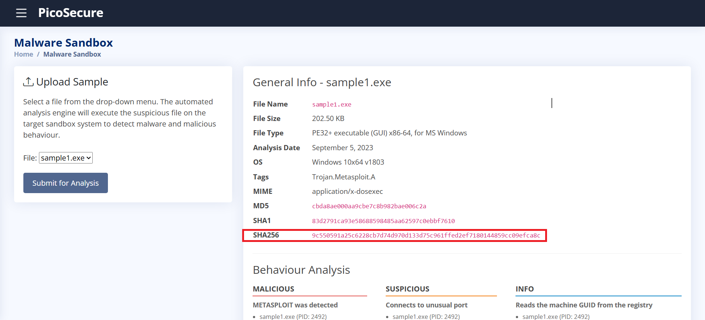

  <em>Figure 1 – Analyzing sample1.exe using the Malware Sandbox tab.</em>

To prevent this malware from executing on the system, I had to block it based on its malware's unique hash value, I have selected the SHA256 hash and used the Manage Hashes tab to add it to the PicoSecure's EDR Hash blocklist.

  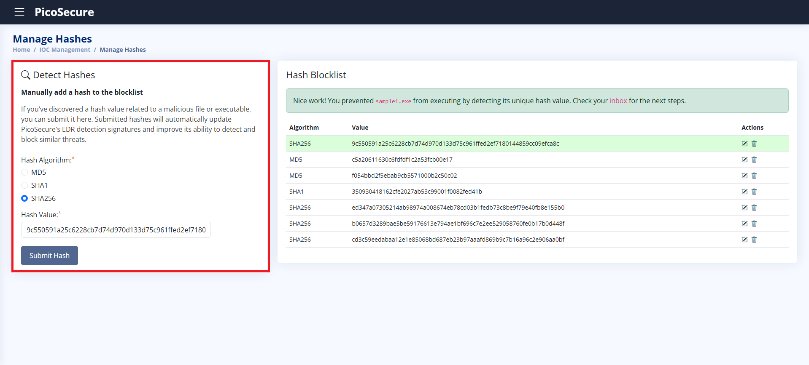

  <em>Figure 2 – Adding the malware unique hash value to the Hash blocklist.</em>

Once done, the EDR will automatically block the malware from running on the system.

Since malware can be easily redesigned to bypass hash blocklist, the tester recompiled it and sent me the sample2.exe.

## Second Malware - (sample2.exe)

After analyzing the second malware using the Malware Sandbox, it provided me the IP address, 154.35.10.113, to which the malware sample was connected, and the ASN, Intrabuzz Hosting Limited, which its name is quite suspicious.

  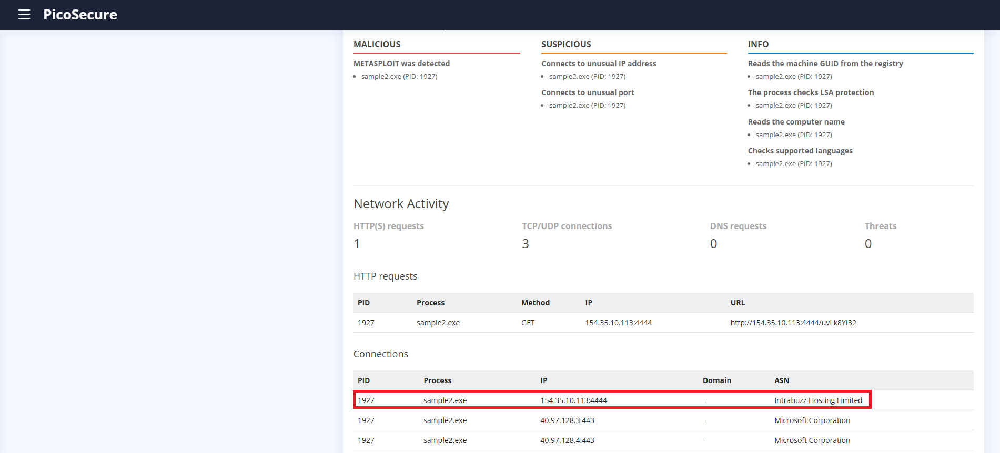

  <em>Figure 3 – Analyzing sammple2.exe using the Malware Sandbox tab.</em>

Now that I know the IP addresses, I moved to the Firewall Rule Manager tab and created a firewall rule to block every packet that are leaving from any source IP to the suspicious IP addresses.

  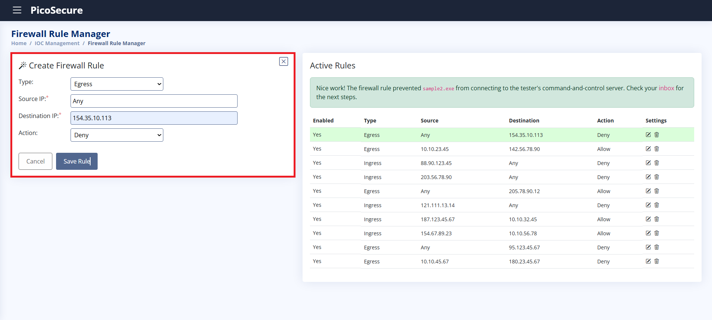

  <em>Figure 4 – Creating a firewall rule to block the suspicious IP addresses.</em>

Blocking by the IP addresses increase the attacker's effort more than blocking by the hash, but is still not enough because the malicious actor can change to another public IP and avoid being detected by my firewall rule. 

Now that the malware is running from a different IP addresses, I needed to create a new plan to block the next malware, sample3.exe.

## Third Malware - (sample3.exe)

Uploading the third malware to the MalwareSandbox, a new IoC has been detected, the tester's domain, emudyn.bresonics.info, in which was being used to send the malware.

  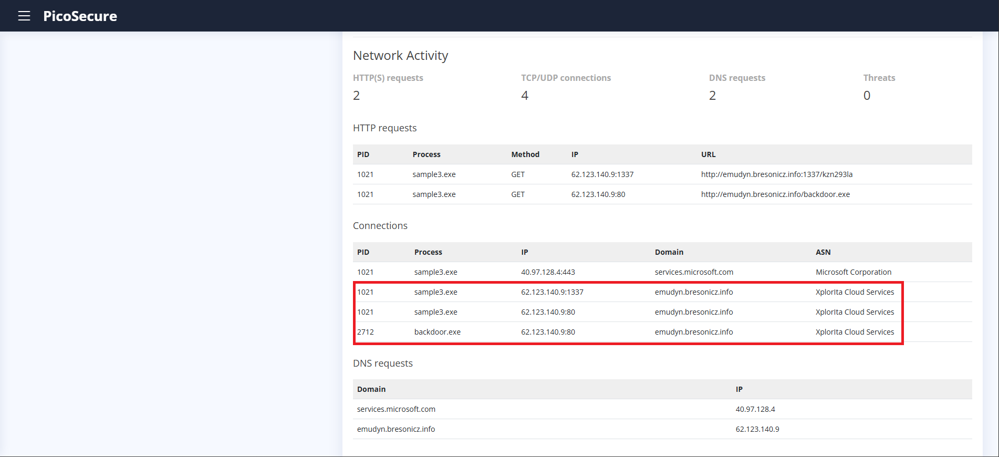

  <em>Figure 5 – Analyzing sample3.exe using the Malware Sandbox tab.</em>

To block the malware, I added it to the DNS Rule Manager, this will deny any connection coming from the suspicious domain.

  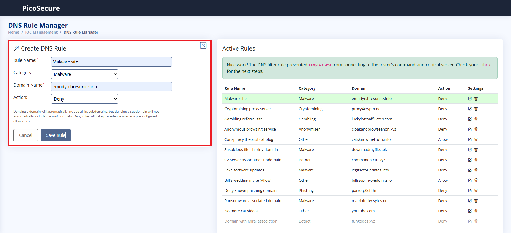

  <em>Figure 6 – Adding malware domain in the DNS Rule Manager.</em>

Blocking the malware's hash, IP addresses and DNS will cause more trouble to the hacker. However, the tester has registered new domain names and sent me the next malware, sample4.exe.

## Fourth Malware - (sample4.exe)

This time the tester has used an advanced approach. To bypass Windows Defender, he has embedded a registry command to automatically disable real-time monitoring of the Windows Defender.

  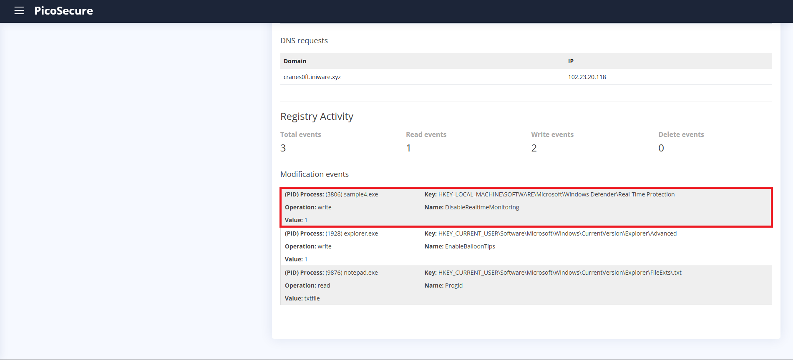

  <em>Figure 7 – Anayzing sample4.exe using the Malware Sandbox tab.</em>

With that in mind, I needed to use the Sigma Rule Builder tool to create a sigma Rule with the registry key, registry name and the value, in order to block anyone trying to disable the function.

  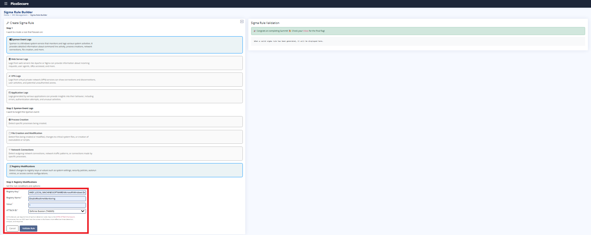

  <em>Figure 8 – Adding malware domain in the DNS Rule Manager.</em>

## Fifth Malware - (sample5.exe)

For the fifth malware, the tester sent me a log of the outgoing connections from the last 12 hours.

  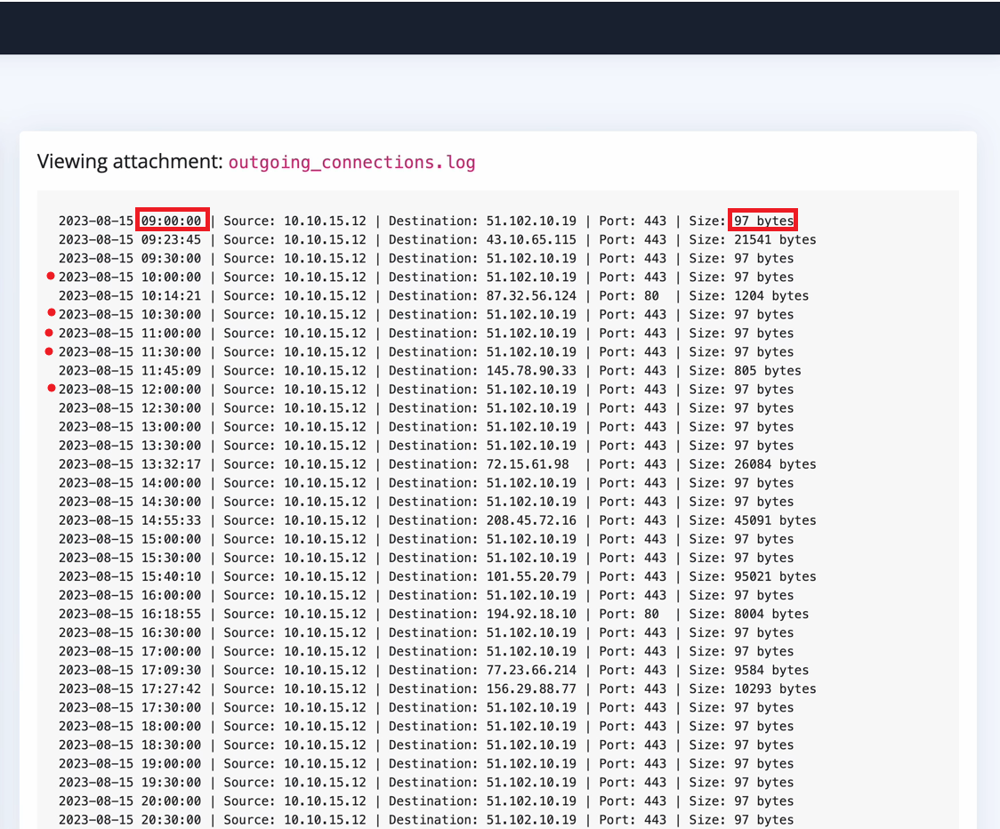

  <em>Figure 9 – Analyzing the outgoing_connections.log.</em>

After Analyzin the log, I realized a pattern, where every 30 minutes, a 97 bytes packet is sent to the remote control server, this specific packet is responsible for maintaining remote access from the hacker to the system. So, I needed to use the Sigma Rule Builder again, but this time, to block every network connection attempt whose packet size is 97 bytes and the frequency 1800 seconds.

  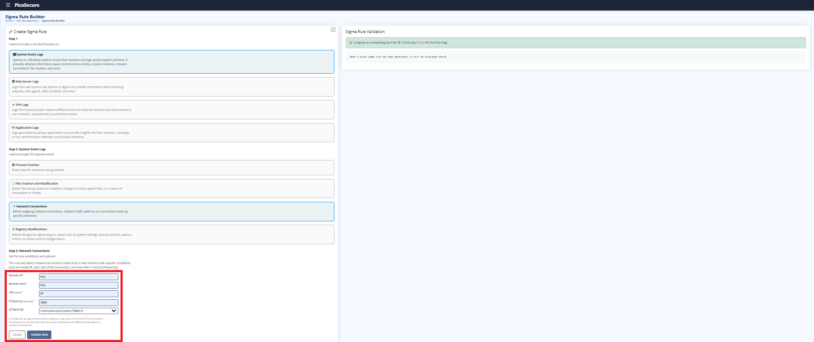

  <em>Figure 10 – Building sigma rule for the sample5.exe.</em>

## Sixth Malware

For the final Malware, the tester has sent me a log containing the actions that he usually perform after gaining remote access.

  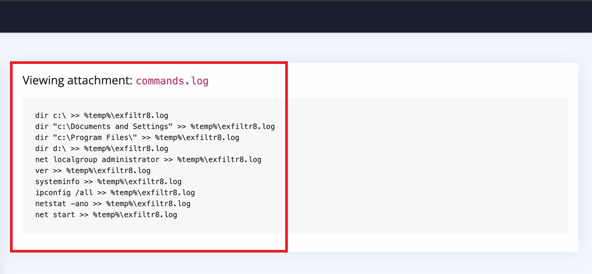

  <em>Figure 11 – Analyzing the commands.log.</em>

The log shows commands like dir, netstat, ipconfig, which are commands used by the cmd.exe being performed on the string %temp%\exfiltr8.log. To block it, I needed to again create a sigma rule for process creation with the name cmd.exe and the string %temp%\exfiltr8.log.

  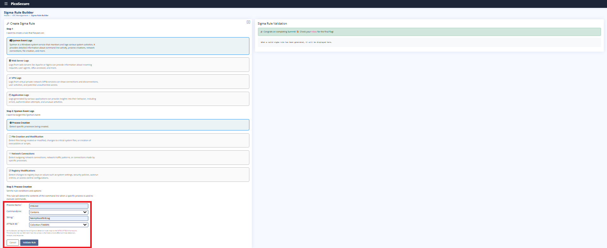

  <em>Figure 12 – Building sigma rule for the sample6.exe.</em>

This was the last malware to detect and prevent, at this time, the hacker would spend a lot of time to probably look for another approach of attacking the company.

## 4. Lessons Learned

- Learned how the Pyramid of Pain increases the operational cost for attackers.
- Learned how to block malware using hashes.
- Learned how to create firewall rules based on malicious IP addresses.
- Learned how to block malicious domains using DNS rules.
- Learned how to create Sigma rules for registry modifications.
- Learned how to detect malicious process creation using Sigma rules.
- Learned how to detect suspicious network connections using Sigma rules.

## 5. References

https://tryhackme.com/room/summit
