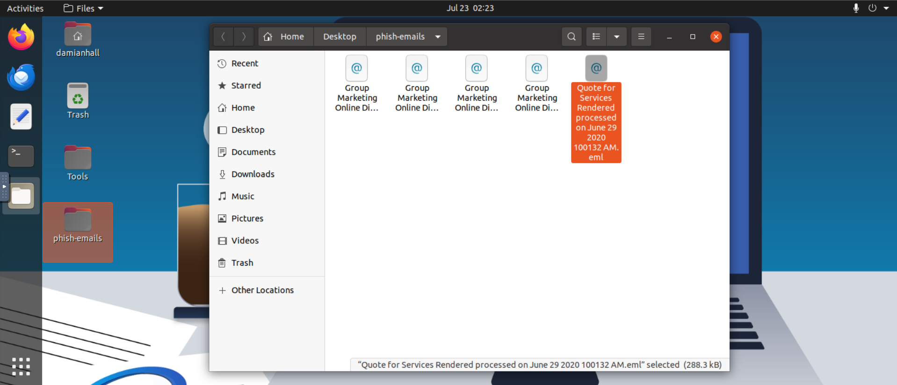
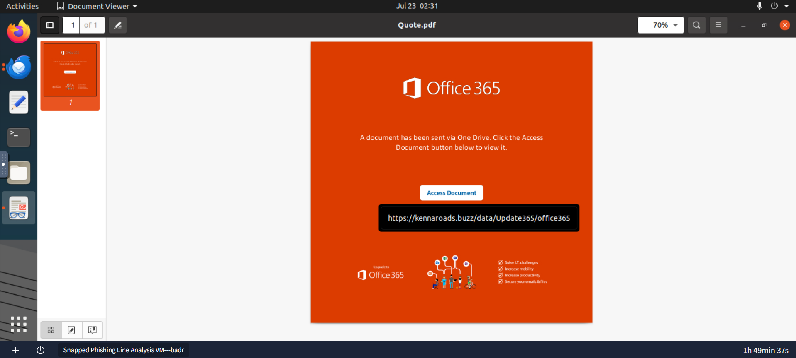
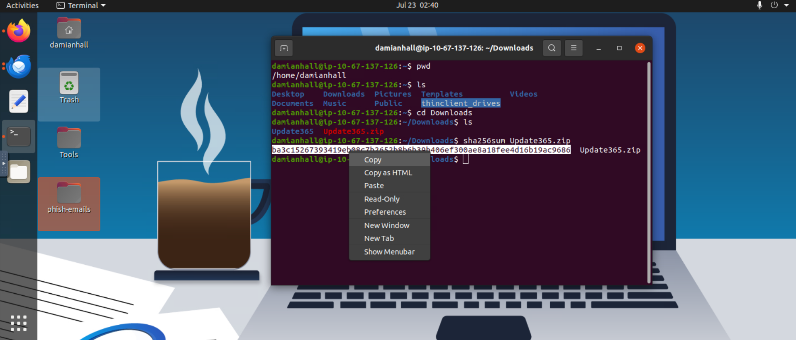
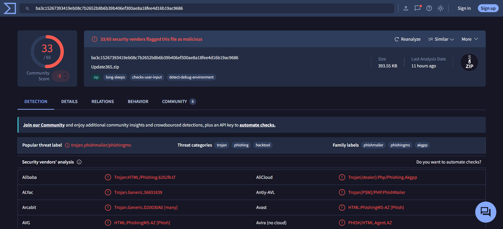
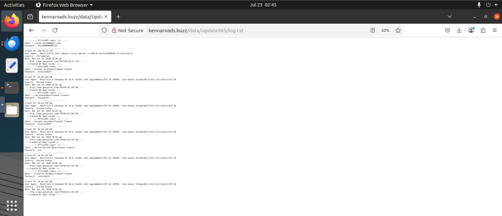
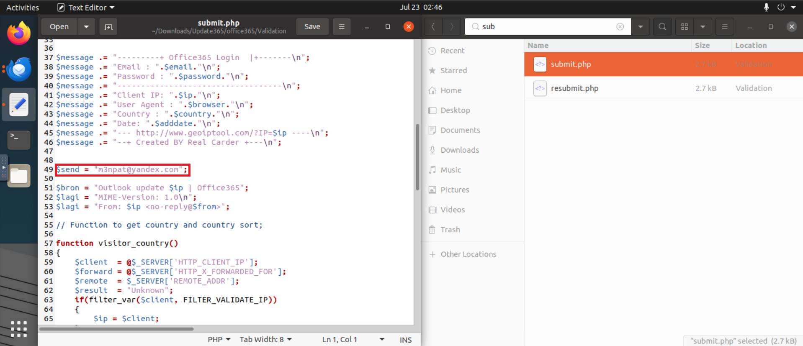

  

<h1 align="center">Snapped Phish-ing Line</h1>

  TryHackMe Laboratory Report

# 1. Objectives
- Analyze the provided email samples to identify key artifacts
- Investigate phishing URLs to understand redirection
- Retrieve and examine the phishing kit used in the attack
- Use CTI tools to gather intelligence on the adversary
- Analyze the phishing kit to uncover additional indicators

# 2. Scenario

As a member of the IT department at SwiftSpend Financial, you are responsible for assisting employees with technical concerns. What initially appeared to be a routine day quickly escalated when multiple employees across different departments reported receiving a suspicious email. Several users noted unusual characteristics in the message, and unfortunately, some had already submitted their credentials and were no longer able to access their accounts. With the potential for a wider compromise, the incident has been escalated for investigation. Your task is to analyze the available evidence, determine the scope of the attack, and uncover how the adversary operated.

# 3. Walkthrough

With the `phish-emails` folder on the Desktop, I started by opening it and reviewing the "Quote for Services Rendered" file.

  

  <em>Figure 1 – Opening the Quote for Services Rendered email</em>

The email contained a header indicating the sender, recipient, timestamp, and subject. The body contained suspicious messages designed to create a sense of urgency and impersonate the group's online marketing team. It also included an attachment named `Quote.pdf`.

  

  <em>Figure 2 – Quote for Services Rendered email.</em>

  

  <em>Figure 3 – Opening Quote.pdf file.</em>

The attachment was a PDF file impersonating Microsoft Office 365. The PDF contained a button that redirected the user to a suspicious domain: `kennaroads.buzz/data/Update365/office365`.

I analyzed the domain using VirusTotal and opened it in a controlled sandbox environment. I then navigated to the `/data` page and downloaded the phishing kit, `Update365.zip`.

  

  <em>Figure 4 – Malicious website.</em>

After downloading it, I opened the terminal and used the `sha256sum` command to obtain its SHA256 hash.

  

  <em>Figure 5 – Using the terminal to obtain the file's SHA256 hash.</em>

With the hash obtained, I uploaded it to VirusTotal.

  

  <em>Figure 6 – Analyzing the hash in VirusTotal.</em>

The file was flagged as malicious.

I then returned to the `/data` page and navigated to `/Update365`. This directory contained a file named `log.txt`, which stored a list of users who had submitted their credentials to the malicious website.

  

  <em>Figure 7 – Analyzing log.txt file.</em>

As my final step, I extracted `Update365.zip`, opened the folder, and searched for a file named `submit.php`. This file contained the email address `m3npat@yandex.com`, which was used by the adversary to collect compromised credentials.

  

  <em>Figure 8 – Getting the redirected email address used by the adversary.</em>

# 4. Lessons Learned

- Learned how to analyze suspicious phishing emails and identify key artifacts.
- Learned how to identify phishing URLs and analyze suspicious domains.
- Learned how to use VirusTotal to investigate suspicious domains and files.
- Learned how to calculate and analyze SHA256 file hashes.
- Learned how to safely investigate potentially malicious files in a controlled environment.

# 5. References

https://tryhackme.com/room/snappedphishingline